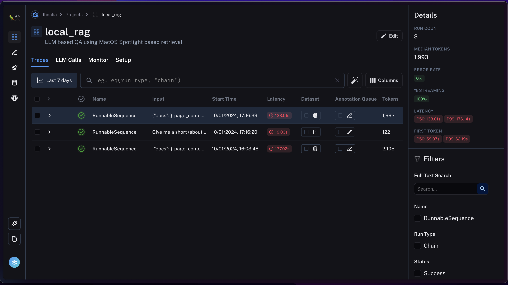

## Introduction

Previously we locally hosted LLMs using [Ollama](https://ollama.ai), and interacted with them in a ChatGPT like interface using [Ollama Web UI](https://github.com/ollama-webui/ollama-webui) also hosted locally. This video continues that journey. Here, I build a solution using a locally hosted LLM and [LangChain](https://langchain.com) (the most popular framework for building LLM solutions).

## Motivation

I love the built-in SpotLight on Mac. It indexes my documents and allows me to search for keywords and find relevant documents. In a lot of cases, I am not looking for a document, I am looking for answers to my questions that I know are somewhere there in my documents. LLMs are good at answering questions. But they don't have my documents. So I want to build a solution that retrieves relevant documents using Spotlight, and then passes them to LLM to generate answers to my questions. Such technique where we first retrieve information from a database or corpus, and then pass it on to an LLM to generate a response is also referred to as a **Retrieval Augmented Generation** solution. Since we'll do everything local, let's call this **Local RAG**.

## Setup
Let's begin by creating a python environment. Let me use conda for this.

```sh
conda create -n local_rag python=3.11
conda activate local_rag
```

Let's now install langchain
    
```sh
pip install langchain
```

For this exercise I want to search thru PDF documents. So let's install `pypdf`. It will help extract text from PDF documents.

```sh
pip install pypdf
```

## Programmatic use of Spotlight
Let's first write a python program to use Spotlight programmatically. Let's create a shell program which receives the query as an input.

```python
import argparse  # To parse command line arguments


def main():
    # Setup argument parser
    parser = argparse.ArgumentParser(description='Search files using Spotlight.')
    parser.add_argument('query', type=str, help='Search query')

    # Parse commandline arguments
    args = parser.parse_args()


if __name__ == "__main__":      # Entry point of the program
    main()
```

Let's now write a function to search using spotlight for files matching this query. We'll use the `mdfind` command and run it as a subprocess. We'll then call this from our `main` function.

```python
import argparse  # To parse command line arguments
import subprocess  # To run spotlight as a subprocess


def search_with_spotlight(query):
    # Prepare the command
    command = ["mdfind"]
    command += [query]

    # Execute mdfind command and capture output
    result = subprocess.run(command, capture_output=True, text=True)

    # Check if the command was successful
    if result.returncode != 0:
        print("Error in executing search")
        return []

    # Split the output into lines to get individual file paths
    file_paths = result.stdout.strip().split('\n')
    return file_paths


def main():
    # Setup argument parser
    parser = argparse.ArgumentParser(description='Search files using Spotlight.')
    parser.add_argument('query', type=str, help='Search query')

    # Parse commandline arguments
    args = parser.parse_args()

    # Perform spotlight search
    search_results = search_with_spotlight(args.query)

    # Print search results
    print(search_results)


if __name__ == "__main__":  # Entry point of the program
    main()
```

Let's run it now.

```sh
python spotlight.py "search_with_spotlight using mdfind"
```

We should see the program file in results.

Let me also extend this to support restricting the search to a specific folder. We'll add a new argument to our program to optionally take in a folder. We'll relay this folder to the `search` function. And use it to restrict the search to this folder.

```python
import argparse  # To parse command line arguments
import subprocess  # To run spotlight as a subprocess


def search_with_spotlight(query, folder=None):
    # Prepare the command
    command = ["mdfind"]
    if folder is not None:
        command += ["-onlyin", folder]
    command += [query]

    # Execute mdfind command and capture output
    result = subprocess.run(command, capture_output=True, text=True)

    # Check if the command was successful
    if result.returncode != 0:
        print("Error in executing search")
        return []

    # Split the output into lines to get individual file paths
    file_paths = result.stdout.strip().split('\n')
    return file_paths


def main():
    # Setup argument parser
    parser = argparse.ArgumentParser(description='Search files using Spotlight.')
    parser.add_argument('--folder', type=str, help='Folder to search in', default=None)
    parser.add_argument('query', type=str, help='Search query')

    # Parse commandline arguments
    args = parser.parse_args()

    # Perform spotlight search
    search_results = search_with_spotlight(args.query, folder=args.folder)

    # Print search results
    print(search_results)


if __name__ == "__main__":  # Entry point of the program
    main()
```

We can now run our search in a specific folder like this:

```sh
python spotlight.py --folder . "search_with_spotlight using mdfind"
```


Since we restricted our search to the current folder, it got us just our program file (which has the query string in it).

## Layering LLM on top of Spotlight
While Spotlight gets us the files of interest containing certain keywords. It doesn't precisely answer our questions. Let's say we have a bunch of resumes in a folder, and want to ask a complex question like "_Give me a short (about 100 words) summary, including contact details, of candidates having coursera certification in Generative AI_". Based on keywords like _resume_, _coursera_, _generative AI_; Spotlight may get us the resume files of interest. But it will not give us a short summary including contact details for the candidates. Let's now use LLMs to do this for us.

Let's begin by writing our driver function.

```python
def generate_answer(question: str, file_paths: list[str], **kwargs: dict) -> str:
    # Get Document objects with text content from file paths
    docs = get_docs(file_paths)

    # Construct QA chain
    qa_chain = build_qa_chain()

    # Prepare input
    input = {"docs":docs, "question":question}
    input.update(kwargs)

    # Invoke the chain
    return qa_chain.invoke(input)


if __name__ == "__main__":  # Entry point of the program
    print(generate_answer(
        question="Give me a short, 100 words summary of each candidate having a coursera certification in Generative AI. Please include their contact details as well.",
        file_paths=["~/Documents/Resumes/Pranav Dhoolia.pdf"],
        doc_type="Candidate Resume"
    ))
```

For this exercise let's assume all our documents are PDFs. Let's write the get_docs function to extract text documents from pdf files.

```python
from langchain.document_loaders import PyPDFLoader
from langchain.schema import Document


def get_docs(file_paths: list[str]) -> list[Document]:
    docs = []
    for file_path in file_paths:
        loader = PyPDFLoader(file_path)
        pages = loader.load()
        docs.append(Document(
            page_content="\n".join(page.page_content for page in pages),
            metadata={"source": file_path}
        ))
    return docs


def generate_answer(question: str, file_paths: list[str], **kwargs: dict) -> str:
    ...
```

Let's now build our QA chain. We'll use the LangChain Expression Language syntax for this. Let's start by defining the Prompt, the LLM model, and the OutputParser

```python
from langchain.document_loaders import PyPDFLoader
from langchain.prompts import PromptTemplate
from langchain.schema import Document, StrOutputParser
from langchain_community.chat_models import ChatOllama
from langchain_core.runnables.base import RunnableSerializable


def get_docs(file_paths: list[str]) -> list[Document]:
    ...


def build_qa_chain() -> RunnableSerializable:
    return (
        {}  ## Build the data to be injected into the prompt
        | PromptTemplate.from_template(
            "Use only the following context to answer the question at the end."
            "\nDo not use anything other than the context below to answer the question."
            "\nI'll repeat it is extremely important that you only use the provided context below to answer the question."
            "\nIf the context below is not sufficient to answer, just say that you don't know, don't try to make up an answer."
            "\n\nContext:\n\n{context}\n\nQuestion: {question}"
        )
        | ChatOllama(model="zephyr:7b-beta-q5_K_M")
        | StrOutputParser()
    )


def generate_answer(question: str, file_paths: list[str], **kwargs: dict) -> str:
    ...
```

Let's now build the data to be injected into the prompt. we'll use the `docs`, `question`, and `doc_type` expected while invoking the chain.

```python
...
from langchain_core.prompts import format_document
...

def build_qa_chain() -> RunnableSerializable:

    def build_context(docs: list[Document], doc_type: str="Document") -> str:
        doc_prompt = PromptTemplate.from_template("{page_content}")
        context = ""
        for i, doc in enumerate(docs):
            context += f"{doc_type} {i + 1}\n---\n{format_document(doc, doc_prompt)}\n\n"
        return context

    return (
        {
            "context": lambda input: build_context(input["docs"], input.get("doc_type", "Document")),
            "question": lambda input: input["question"]
        }
        | ...
    )
```


## Debugging LLM solutions
One of the reasons I really love LangChain, is that with LangSmith, it offers a very powerful debugging experience. So before running our LLM layer, let's set up LangSmith.

1. Go to [LangSmith](https://smith.langchain.com) and login with your credentials

2. Create your API key for your Organization

3. Create a new project

4. Setup the environment variables. I have set these up in my `.zshrc`.


Let's now run our LLM layer.


It returns here a quick summary of the candidate matching the query, along with their contact details.

Let's now goto LangSmith and see the various aspects of LLM execution that happened here!
- Let go back to our project and check Traces

- We see a trace for our chain execution. Let's expand it

- We can see the things corresponding to components we used in building the chains, i.e., the data, the prompt, the chat model, and the output parser
- For the data, we can see the input, and what the context built from it looks like

- For the prompt, we can see data input to the template, and the prompt generated from it

- For the chat model, we can see the prompt input to the model, and the output generated by it

- For the output parser, we can see the input to it, and the output produced by it.

This offers a powerful general debugging experience.

Further, if we want to fine tune our model, based on the usage of our application over a period of time, we can select the traces we want to use for fine tuning, and easily construct a dataset to use for fine tuning from it like this.
- select the trace(s) and click on the `Add to Dataset` button

- Since we don't already have a dataset, we'll create a new one

- And now we can see a preview of dataset being created as well.
    - In the preview here we can see as input columns: the context, the question, and the doc domain type, and as output the LLM's response.

- Over a period of time, once we have enough traces, we can select and add all good traces to this dataset, and use it for fine tuning our model!

## Combining the two
So we have built a programmatic interface to Spotlight, and we have built an LLM based QA chain that given some content can precisely answer a question based on that content. We now need to chain the two together. Before we do that, let's first understand a little complication that we anticipate here. As we saw earlier, for our complex query, Spotlight didn't return anything. That's because it searched for files contained all the words in our query. But our query really wants a much smaller subset of keywords to be searched for. Most of the query is really a description of what we want from the files found containing that subset of keywords.

So we need to first extract the keywords from our query, and then use Spotlight to search for files containing those keywords. Once again an LLM chain is perhaps the best for identifying those keywords so let's write first write a function to do that.

```python
import json

from langchain.prompts import PromptTemplate
from langchain.schema import StrOutputParser
from langchain_community.chat_models import ChatOllama


def extract_keywords(query: str) -> list[str]:

    # Construct the keyword extraction chain
    keyword_extraction_chain = (
        {
            "query": lambda query: query
        }
        | PromptTemplate.from_template(
            "From the query below please extract search keywords. "
            "The search keywords must be part of the query string. "
            "Avoid words general to this domain such as: candidates, resume, contact, and details. "
            "Output a json formatted list of keyword strings. "
            "Each item in the output json should be a string."
            "\n\nQuery:\n```{query}\n```"
        )
        | ChatOllama(model="zephyr:7b-beta-q5_K_M")
        | StrOutputParser()
    )

    # Invoke the chain
    response = keyword_extraction_chain.invoke(query)

    # Get the substring between last `[` and `]`
    return json.loads(f'[{response[response.rfind("[") + 1:response.rfind("]")].strip()}]')


if __name__ == "__main__":  # Entry point of the program
    print(extract_keywords("Give me a short (about 100 words) summary of candidates having coursera certification in Generative AI. Please include their contact details."))
```

Now that we have our search keywords extractor, let's modify our main function to combine everything.

```python
...
from keywords import extract_keywords
from qa import generate_answer


def search_with_spotlight(query, folder=None):
    ...
    return file_paths


def main():
    ...
    args = parser.parse_args()

    # Let's extact keywords from the query
    keywords = extract_keywords(args.query)

    # Construct an OR query from the keywords
    query = " OR ".join(keywords)

    # Perform spotlight search
    search_results = search_with_spotlight(query, folder=args.folder)

    # Generate answer from the query and top 3 search results
    return generate_answer(args.query, search_results[:3], doc_type="Candidate")


if __name__ == "__main__":  # Entry point of the program
    print(main())
```

Let's now run everything together!
```sh
python spotlight.py --folder ../test/resume "Give me a short (about 100 words) summary of candidates having coursera certification in Generative AI. Please include their contact details."
```


Works like a charm!

## Conclusion
In this video we used locally hosted LLMs along with Langchain framework to build an LLM solution. This solution provided amazing answers to quite complex questions on our local content. What's more, we didn't even have to setup any additional tools. 

We used Spotlight to search for files containing certain keywords, and then used LLMs to precisely answer questions based on those files. We also saw the power of the LangChain framework, in how easy it was to use LangSmith to debug our LLM based solutions, and how easily we could use it to create datasets, based on the usage traces of our solution, to fine tune our models.